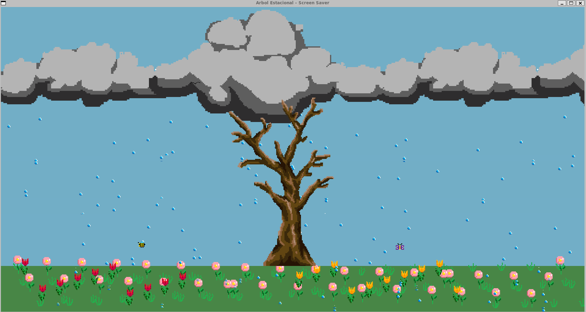
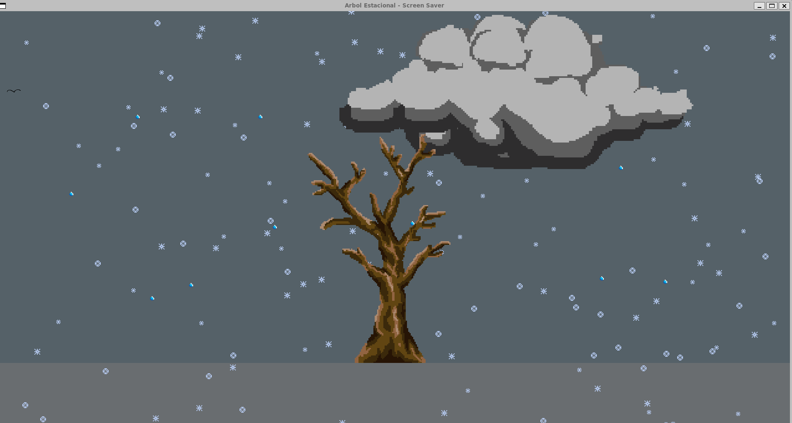

# 🌳 Screen Saver – Árbol Estacional

## Estructura del proyecto

```
proyecto1_paralelas/
├── main.cpp              # Init SDL, loop principal y eventos
├── Makefile              # Compilación del proyecto
├── integrantes.c         # Nombres del equipo
├── README.md
├── .gitignore
├── assets/
│   ├── animals/
│   │   └── bird.png
│   └── tree/
│       └── tree.png
└── src/
    ├── bird.hpp / bird.cpp   # Pájaro (update + render)
    └── tree.hpp / tree.cpp   # Árbol estático (load + render)
```

## Compilación y ejecución

**Dependencias:** `SDL2` y `SDL2_image` (y un compilador C++ con soporte C++17).

```bash
# Compilar
make

# Ejecutar (desde la raíz del proyecto, para cargar assets/)
./screensaver

# Limpiar binarios y objetos
make clean
```

### Controles de estaciones

Las estaciones cambian automaticamente cada 30 segundos. Durante los ultimos
8 segundos se mezclan gradualmente los colores y la presencia de los elementos:
las flores desaparecen una por una, mientras la abeja y la mariposa ajustan su
opacidad. Tambien se pueden probar manualmente desde la ventana:

- `1`: primavera
- `2`: verano
- `3`: otono
- `4`: invierno
- `Esc`: salir

### Comparación secuencial vs paralela

Se agregaron rutas secuenciales para las actualizaciones de:

- flores
- tulipanes
- nubes
- hojas

La animacion ahora puede ejecutarse en cualquiera de los dos modos:

```bash
./screensaver --parallel
./screensaver --sequential
```

Y un benchmark reproducible en consola para compararlas contra sus versiones
paralelas usando exactamente la misma logica de actualizacion:

```bash
./screensaver --benchmark
```

Si quieres medir solo un modo:

```bash
./screensaver --benchmark --parallel
./screensaver --benchmark --sequential
```

Tambien se puede activar con `SCREENSAVER_BENCHMARK=1 ./screensaver`. El
reporte imprime tiempo secuencial, tiempo paralelo y la aceleracion estimada
para cada algoritmo cuando se usa el modo comparativo.

La configuracion compartida de cada estacion esta en `src/season.cpp`. Los
elementos nuevos deben consultar `SeasonSystem` y `SeasonProfile` para adaptar
su cantidad, color o comportamiento sin duplicar la logica de estaciones.
El arbol usa la textura base. Las hojas animadas de primavera y las hojas de
otono, que se acumulan en el suelo, se administran desde `src/leaf.cpp`. La posicion y la
caida de cada hoja se actualizan en paralelo por bloques independientes.
Los animales animados reutilizables se implementan en `src/flying_animal.cpp`.
La lluvia y la nieve usan el sistema de particulas de `src/weather.cpp`, y la
grama animada se administra desde `src/grass.cpp`. Sus intensidades se definen
en cada `SeasonProfile` y se interpolan durante los cambios de estacion.

Compilación manual equivalente:

```bash
g++ -std=c++17 -I. -o screensaver main.cpp src/bird.cpp src/tree.cpp \
  $(pkg-config --cflags --libs sdl2 SDL2_image)
```

---

## Descripción

El proyecto consiste en un **Screen Saver animado** cuyo elemento principal será un árbol que evolucionará dinámicamente según la **estación del año** y el **momento del día**. Mientras la computadora permanezca inactiva, el escenario cambiará gradualmente para simular el paso del tiempo, generando una experiencia visual relajante y diferente en cada ejecución.

Cada elemento del escenario podrá configurarse de forma independiente, permitiendo modificar su frecuencia de aparición y otros parámetros relacionados.

---

# Objetos del escenario

- 🌳 Árbol (tronco y follaje)
- 🍃 Hojas
- 🌱 Piso
- 🌸 Flores
- ❄️ Nieve
- 🌧️ Lluvia
- ☁️ Nubes
- ☀️ Sol
- 🌙 Luna
- ⭐ Estrellas
- 🐦 Pájaros
- 🦋 Mariposas
- 🐈 Gato
- ✈️ Aviones
- ☄️ Cometas o estrellas fugaces *(opcional)*

---

# Configuración

Cada objeto podrá configurarse de manera independiente mediante parámetros, permitiendo controlar aspectos como:

- Frecuencia de aparición.
- Cantidad máxima de elementos visibles.
- Intensidad de efectos (lluvia, nieve, viento, etc.).
- Activar o desactivar elementos específicos.

---

# Sistema de tiempo

El protector de pantalla contará con un sistema que simulará el paso del tiempo mientras permanezca activo.

## Estaciones

- 🌸 Primavera
- ☀️ Verano
- 🍂 Otoño
- ❄️ Invierno

## Ciclo del día

- ☀️ Día
- 🌙 Noche

Los cambios de estación y del ciclo día/noche ocurrirán automáticamente conforme transcurra el tiempo de inactividad. La velocidad de esta transición podrá configurarse para ofrecer una experiencia más dinámica.

---

# Comportamiento por estación

## 🌸 Primavera

- Árbol con follaje abundante.
- Colores vivos.
- Muy pocas hojas caerán.
- Aparecerán flores en el suelo.
- Las mariposas revolotearán sobre las flores.
- Mayor presencia de aves.

---

## ☀️ Verano

- Árbol completamente frondoso.
- Tonos verdes ligeramente más opacos.
- Caída ocasional de hojas.
- Cielo despejado con algunas nubes.
- Mayor actividad de aves.

---

## 🍂 Otoño

- Disminución del follaje.
- Caída constante de hojas.
- Colores café, amarillo y naranja.
- Ambiente más seco.

---

## ❄️ Invierno

- Árbol sin hojas.
- Caída de nieve.
- Suelo cubierto de nieve.
- Colores fríos y ambiente tranquilo.

---

# Ciclo día y noche

El comportamiento natural del árbol continuará independientemente del momento del día. Por ejemplo, si una estación contempla la caída de hojas, esta seguirá ocurriendo durante la noche.

## ☀️ Día

- Sol.
- Nubes.
- Iluminación natural.

## 🌙 Noche

- Luna.
- Estrellas.
- Posibilidad de cometas o estrellas fugaces.
- Iluminación tenue.

---

# Aparición de elementos

Los elementos decorativos aparecerán de forma aleatoria para dar vida al escenario. Algunos tendrán condiciones específicas para aparecer.

| Elemento | Condición |
|----------|-----------|
| 🦋 Mariposas | Solo cuando existan flores. |
| 🐦 Pájaros | Principalmente durante el día. |
| 🐈 Gato | Puede aparecer en cualquier momento y estación. |
| ✈️ Aviones | Pueden cruzar el cielo en cualquier momento. |
| ☄️ Estrellas fugaces | Solo durante la noche y con baja probabilidad. |

---

# Reglas de interacción

Algunos elementos dependerán de la presencia de otros para aparecer.

Ejemplos:

- Las mariposas solo aparecerán si existen flores.
- Las mariposas se moverán alrededor de las flores.
- Las estrellas fugaces únicamente podrán aparecer durante la noche.
- La nieve solo aparecerá durante el invierno.
- La lluvia podrá aparecer en cualquier estación, aunque será más frecuente durante primavera.

---

# Configuración sugerida

Cada elemento podría contar con parámetros similares a los siguientes:

```json
{
  "enabled": true,
  "spawnRate": 0.5,
  "maxInstances": 5
}
```

Donde:

- **enabled**: habilita o deshabilita el elemento.
- **spawnRate**: probabilidad de aparición.
- **maxInstances**: cantidad máxima visible simultáneamente.

---

# Posibles mejoras futuras

- 🌬️ Sistema de viento que afecte hojas, lluvia y nieve.
- 🌈 Aparición de arcoíris después de la lluvia.
- 🐿️ Animales adicionales (ardillas, conejos, etc.).
- 🌳 Variaciones del árbol según la estación.
- 🔆 Iluminación dinámica según la posición del sol o la luna.
- 🎵 Sonidos ambientales opcionales.
- 🌫️ Neblina o niebla en determinadas condiciones.
- 🌧️ Tormentas con relámpagos poco frecuentes.
- 🐦 Bandadas de aves cruzando el cielo.
- 🎄 Eventos especiales según fechas (Navidad, Halloween, etc.).

---

# Objetivo

Crear un protector de pantalla dinámico, relajante y visualmente atractivo que nunca se vea exactamente igual dos veces, gracias a la combinación de estaciones, ciclo día/noche y eventos aleatorios.


# Algunas Screenshots


